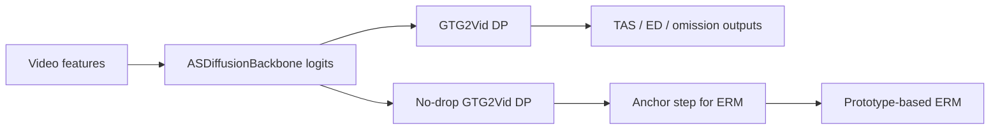

# GTG-memory Project Recap

## One-line summary

GTG-memory is a research prototype built on top of the GTG/GTG2Vid procedural video error-recognition pipeline. The project explores whether visual memory, semantic memory, and a soft multi-candidate ERM can improve action segmentation, omission detection, and error-type recognition.

## Original problem

The upstream GTG pipeline handles procedural videos such as EgoPER `tea`, `oatmeal`, `pinwheels`, `quesadilla`, and `coffee`. Each task is represented as a task graph. The model first produces frame-to-node logits, then GTG2Vid aligns the video to the graph with dynamic programming.

The target outputs are:

- TAS: task/action segmentation, or which step each frame belongs to.
- ED: binary error detection, or whether a frame/segment is erroneous.
- Omission: which required task steps were skipped.
- ER: error recognition, or which error type occurred.

The project hypothesis was that the original frame-level logits and single-anchor ERM were too local and brittle. Procedural videos need explicit memory of previous visual evidence, task progress, graph topology, and semantic normal/error prototypes.

## Baseline pipeline

Important files:

- `main.py`: command-line entry point.
- `runner.py`: training, evaluation, GTG2Vid calls, ERM calls, and metric logging.
- `models/models.py`: backbone integration.
- `datasets/loader_graph.py`: task graph definitions.
- `dp/graph_utils.py`: generalized metagraph dynamic programming.
- `utils/metrics.py`: TAS, ED, ER, and omission metrics.

## Implemented extensions

### Visual memory

Implemented in `models/visual_memory.py` and integrated through `models/models.py`.

The visual-memory branch keeps the upstream backbone trunk, then adds:

- a base feature projector,
- a 256-dimensional short memory with `GRUCell`,
- a 384-dimensional slow long memory with a capped write gate,
- feature-level fusion over base, short, and long states,
- a new final head that produces GTG-compatible logits.

The intended role was to stabilize frame-to-step logits around transitions, ambiguous local actions, and short error-like perturbations.

### Semantic memory

Implemented in `models/semantic_memory.py`, `models/fusion_heads.py`, and `utils/semantic_prototype_loader.py`.

The semantic branch loads normal step prototypes and error prototypes from:

- `vc_normal_action_features`
- `vc_chatgpt4omini_error_features`

It then computes:

- step posteriors with cosine similarity and GTG topology bias,
- error posteriors over likely step/error candidates,
- coverage and uncertainty traces,
- semantic short/long memory states,
- an asymmetric visual-semantic fusion gate,
- a prototype head that boosts real step nodes.

The intended role was to make logits aware of graph progress and normal/error semantic evidence before GTG2Vid runs.

### Soft candidate ERM

Implemented in `src/erm/soft_erm.py` and called from `runner.py` when `use_new_erm=true`.

For frames predicted as errors, the ERM v1 candidate set combines:

- the no-drop GTG2Vid anchor step,
- semantic posterior top candidates,
- graph neighbors of the anchor,
- coverage-aware candidate weighting.

It builds a query from frame features, visual memory, semantic memory, and semantic observations, then scores normal/error prototype pairs.

## Current status

The visual-memory prototype is the most coherent part of the project. It has a complete code path, generated configs, and a five-task comparison report.

The semantic-memory prototype is implemented and has training/evaluation artifacts, but the average metrics do not yet prove a stable benefit.

The soft ERM v1 is implemented but should be treated as an unsuccessful or unfinished experiment. On the available logs it often hurts ED/ER, so it should not be presented as a completed improvement.

## Main technical debt

- The previous branch contained committed merge-conflict markers in several scripts; these have been resolved in the cleanup branch.
- The README was still mostly the upstream GTG README.
- EgoPER script utilities are now centralized in `scripts/egoper_utils.py`.
- Several scripts and configs hard-code `/root/autodl-tmp/...`, so the project is AutoDL/Linux-oriented.
- Many checkpoints, TensorBoard events, logs, and generated outputs are present in the working tree/history.
- `notes/semantic_memory_impl.md` is empty and should either be filled or removed later.
- Existing reports do not yet form a single final paper-style experiment table covering baseline, visual memory, semantic memory, and ERM.

## Recommended continuation

1. Keep the current code changes as a cleanup branch.
2. Do not delete existing experiment artifacts until the useful metrics have been extracted.
3. Produce one canonical report with baseline, visual-memory, semantic-memory, and semantic+ERM rows.
4. Decide whether the research story is mainly visual-memory improving GTG2Vid logits, or semantic/ERM improving error-type recognition.
5. If continuing the research, redesign ERM after fixing the reproducibility story.
